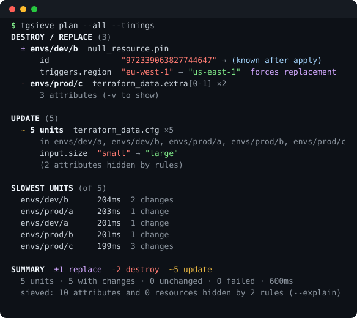

# tgsieve

Run `terragrunt run --all -- plan` over a heavy stack and you get thousands of
lines of terraform prose, in which the two changes you care about are somewhere
between a tag timestamp and the ninth identical `count` instance.

`tgsieve` runs the plan for you, reads the **structured** output instead of the
prose, throws away the noise you declared as noise, collapses everything that
repeats, and prints what is left.

<p align="center">
  
</p>

That is five units of a terragrunt plan — the same run terraform prints as
several hundred lines. Every number in it is real output, not a mock-up; the
image is regenerated from an actual run (see [Development](#development)).

The report nests three deep — **where**, then **what**, then **which fields**:

```
UPDATE (5)
  envs/prod/c                            ← the unit, said once
    ~ aws_s3_bucket.this                 ← the resource
        tags_all.entity  "tgb" → "tgc"   ← the attributes that changed
```

A change collapsed across units replaces the directory with the set it covers
(`5 units  envs/dev/a, envs/dev/b, …`), so the first column always answers the
same question.

## How it works

There is no screen-scraping. `tgsieve` asks terragrunt for machine-readable
artifacts and reads those:

| What | Flag it passes | What it gets |
| --- | --- | --- |
| per-unit plans | `--json-out-dir` | one `tfplan.json` per unit — the full `terraform show -json` document |
| live progress | `--log-format json` | NDJSON events tagged with `working-dir`, so failures surface the moment they happen |
| run report | `--report-file/--report-format json` | per-unit result and duration, including units that failed before producing a plan |

From each plan it computes a real attribute-level diff — flattening
`before`/`after`/`after_unknown` into dotted paths, honouring
`replace_paths`, sensitivity, and unknown subtrees.

Two terragrunt details this works around:

- `terragrunt run --all -- plan -json` is **not** usable. Terragrunt forwards
  terraform's own NDJSON straight through, so lines from units running in
  parallel interleave with no way to tell them apart.
- `--json-out-dir` and `--out-dir` only apply to `--all` runs. For a
  single unit `tgsieve` drives it itself: plan to a binary file, then
  `terragrunt run -- show -json <file>` to get the same document. That path
  can also ask terraform for `-json` directly, which is what feeds
  resource-level progress — with one unit there is nothing to interleave with.

Works with either backing binary: terragrunt defaults to `tofu`, and if that
is not installed but `terraform` is, `tgsieve` points it at `terraform` rather
than failing. Both are exercised against the same stack, including drift.

If both are installed, terragrunt uses `tofu` — and a stack whose state and
lock files were written by `terraform` will refuse to initialize under it:

```
Error: Backend initialization required: please run "tofu init"
Error: Inconsistent dependency lock file
```

Choose the binary explicitly with `--tf-path terraform` or `TG_TF_PATH`. When
units fail, the report names the binary terragrunt actually ran, since that is
the first thing worth knowing.

## Install

```bash
brew install imcitius/tap/tgsieve
```

```bash
go install github.com/imcitius/tgsieve@latest
```

or from a checkout: `go build -o tgsieve .`

## Use

```bash
tgsieve apply                                 # plan, show, ask, then apply exactly that
tgsieve plan                                  # only the unit in the working directory
tgsieve plan --all                            # the whole stack below the working directory
tgsieve plan -C envs/prod --all -- -refresh=false   # args after -- go to terraform
tgsieve plan --all --keep-plans ./plans       # keep the per-unit tfplan.json
tgsieve show ./plans --explain                # re-render, no re-run
tgsieve plan --all --detailed-exitcode        # 0 = nothing survived the sieve, 2 = something did
tgsieve rules                                 # what config is in effect, and from where
tgsieve init                                  # write a starter .tgsieve.yaml at the project root
```

**The stack is never planned implicitly.** `--all` (`-a`) is opt-in for both
`plan` and `apply`, so a mistyped command touches one unit rather than the
whole estate.

## Applying

`tgsieve apply` plans, shows the sieved report, asks, and then applies **the
plan files it just showed you** — not a fresh plan made after you answered.
Terragrunt honours saved plan files, so a configuration change between the
question and the answer cannot slip into the apply.

```
apply 9 changes across 5 units? [yes/no] yes
4 resources will be destroyed or replaced — type 'destroy' to confirm: destroy
```

The second question only appears when something will be destroyed or replaced,
and it wants that word rather than another "yes" — those are the changes that
running the tool again will not undo.

Outside a terminal it refuses rather than assuming: `--auto-approve` is how you
say you meant it in CI, and it still prints what is about to be destroyed.

To review now and apply later, save the plans and hand them back:

```bash
tgsieve plan  --all --keep-plans ./plans --out-dir ./plans
tgsieve apply --all --plans ./plans
```

Those plans carry the provenance described below, so an apply against code that
has moved on is refused rather than applied.

Useful flags: `-v` (attributes for creates and destroys too), `--show-empty`,
`--explain`, `--timings` (slowest units), `--no-sieve`, `--no-color`,
`--max-attrs`, `--max-units`, `--out-dir` (keep binary plans so you can apply
exactly what you reviewed), `--tg-args` (pass extra flags to terragrunt).

Scoping and pacing a stack run: `--filter <query>` (repeatable),
`--filter-affected` (only units touched between `main` and `HEAD`) and
`--parallelism N` are passed through to terragrunt. All three need `--all`,
because there is no queue to filter or pace without it.

`--fast` skips the refresh (`-refresh=false`). On a heavy stack that is the
single biggest speed-up available, and the summary says so every time, because
a plan that never looked at reality can report "no changes" for a stack that
has drifted:

```
state was not refreshed: anything changed outside terraform is invisible here
```

`--resume` picks up where an interrupted or partly failed run stopped. It
compares the queue against the plans already in `--keep-plans` and runs only
the units that never produced one:

```bash
tgsieve plan --all --keep-plans ./plans          # 40 units, Ctrl-C at 31
tgsieve plan --all --keep-plans ./plans --resume # runs the missing 9
```

The final report covers all of them — reused plans and fresh ones — and says
how many were reused.

Reusing a plan is only sound if the code has not moved under it, so a fresh run
records the commit and a fingerprint of the uncommitted changes in
`.tgsieve-run.json` beside the plans, and `--resume` refuses to mix
generations:

```
the plans in ./plans were made at 1cb275fd, the working tree is now at 4a91e0c2
  re-run without --resume to plan the stack fresh, or pass --force to mix generations
```

The fingerprint ignores what a run creates for itself — `.terragrunt-cache`,
`.terraform`, state and plan files — since otherwise no two runs would ever
agree. Outside a git repository (a stack pulled from a `--source` URL, an
unpacked archive) the fingerprint is taken from the configuration files
themselves, so the check still holds.

The check also covers where each unit's code comes from: a run that keeps its
plans records every unit's resolved `terraform { source }`, so a remote module
whose ref moved invalidates the generation even though the repository did not
change. Sources that cannot be resolved are recorded as unknown rather than
assumed unchanged.

A source pinned to a branch — or to a tag someone can move — reads identically
before and after the code it names changes, so each remote ref is resolved to a
commit with `git ls-remote`. That is one call per distinct repository and ref,
not per unit, and `--no-resolve-refs` turns it off for offline or air-gapped
runs. An unreachable remote degrades to the unresolved source rather than
failing the run. Units materialized by `terragrunt stack generate` are
fingerprinted too, since `.terragrunt-stack` is usually gitignored and git
would otherwise report an unchanged tree.

A `--keep-plans` directory is locked while a run writes to it, so two runs
cannot interleave their plans into one incoherent report. A lock left by a
crashed run is taken over automatically; a live one is reported:

```
./plans is in use by another tgsieve run (pid 51216, started 11:40PM)
```

A lock written on another machine — a directory shared over a network mount —
cannot be checked for liveness, so it is respected for six hours and taken over
after that. `--lock-wait 2m` waits for a busy directory instead of failing
immediately, which is usually what a CI pipeline racing another one wants.

Unit durations are remembered per directory, so after a resume the timings
cover the whole stack rather than only the units that just ran. Reused
measurements are labelled with their age and expire after two weeks, since a
unit that has since been split or sped up should not keep its old reputation.

While the run is in flight you get one status line and nothing else, plus any
unit's failure the moment it happens rather than at the end:

```
⠴ planning · 12/28 planned · 4 running · 47s
```

The queue size comes from `terragrunt find`, so the denominator is known before
the first unit starts, and `running` separates work in flight from units still
waiting on the DAG. A single-unit run has no such scale, so it counts resources
instead — `8 resources refreshed · 1 to change` — read from terraform's own
`-json` event stream. Outside a terminal all of this collapses to a plain
heartbeat line every 30 seconds, so CI logs still show liveness.

Ctrl-C forwards the interrupt so terraform can release its state locks, prints
the report for whatever finished, lists the rest under `NOT RUN`, and exits 130.

When a whole stack fails for one reason — an expired credential, a backend
that does not exist — the error is printed once with the units it hit, not once
per unit:

```
FAILED (5)
  ✗ 5 units, same error
      envs/dev/a, envs/dev/b, envs/prod/a, +2 more
      Error: no valid credential sources found
```

`--fail-on high` exits 2 only when something at that severity survived, so a
pipeline can stop for a replacement without stopping for a new log group.
Actions rank as `delete`/`replace` high, `update`/`drift` medium, `create` low,
and the `severity:` block overrides that per action. The summary always states
the spread:

```
SUMMARY  ±5 replace  ~10 update
  severity: 5 high, 10 medium
```

Exit codes distinguish the three ways a run can be unhappy, so CI can react to
each differently:

| code | meaning |
| --- | --- |
| `0` | ran fine |
| `1` | tgsieve itself failed — bad flags, terragrunt would not start, unreadable plans |
| `2` | changes survived the sieve (`--detailed-exitcode`, or `--fail-on` was met) |
| `3` | one or more units failed to plan |
| `130` | interrupted with Ctrl-C |

## Plain terraform, no terragrunt

A root module big enough to be unreadable has the same problem as a stack,
minus the queue — so the sieve works there too:

```bash
tgsieve plan  --engine terraform          # a plain root module in this directory
tgsieve plan  --engine terraform --init   # run init first
tgsieve apply --engine terraform
```

It drives `terraform` directly (or `tofu` — `--tf-path` and `TG_TF_PATH` both
apply, and whichever is installed is used by default), reads terraform's own
`-json` event stream for progress, and renders the plan JSON through the same
rules, collapsing and formats as everything else, including `--format md`.

The flags that only mean something with a queue behind them — `--all`,
`--filter`, `--filter-affected`, `--parallelism`, `--resume` — say so rather
than being quietly ignored:

```
--all needs terragrunt: the terraform engine plans one root module
```

## CI and pull requests

`--format md` renders the same report as markdown for a pull request comment:
destructive changes stay open, everything else folds into `<details>`, and the
output is capped (`--max-bytes`, default 55000) so it is trimmed deliberately
rather than rejected by GitHub's comment limit.

```bash
tgsieve plan --all --format md
```

```markdown
## tgsieve

**±4 replace** · **-8 destroy** · ~4 update

5 units · 5 with changes · 0 unchanged · 0 failed · 1s

> **12 resources will be destroyed or replaced.**

### Destroy / replace (12)

**4 units** — envs/dev/a, envs/prod/a, envs/prod/b, envs/prod/c
- `±` `null_resource.pin` ×4
  - `triggers.region` `"eu-central-1"` → `"us-west-2"` — **forces replacement**

<details><summary><b>Update (4)</b></summary>
…
</details>
```

With Atlantis, run it from a custom workflow — the command's output becomes the
comment, and the exit codes described above decide whether the step passed:

```yaml
workflows:
  tgsieve:
    plan:
      steps:
        - init
        - run: tgsieve plan --all --format md --fail-on high
    apply:
      steps:
        - run: tgsieve apply --all --auto-approve --format md
```

`--fail-on high` turns the plan step red only when something is destroyed or
replaced. `apply` needs `--auto-approve` in CI, since without a terminal to ask
it refuses rather than assuming.

## Noise rules

`tgsieve init` writes a starter file at the project root — the git root, or
failing that the highest directory that still holds a terragrunt root config
(`--here` writes into the current directory instead, `-C <dir>` anywhere).

Nothing is hidden until you say so. `.tgsieve.yaml` is looked up from the
working directory upwards, stopping at the repo root; every file found is
merged, nearer files winning.

```yaml
version: 1

extends: [builtin/aws-tags]   # curated rule sets — see "tgsieve presets"

hide:
  unchanged_units: true   # units with nothing left to say become a count
  drift: false            # refresh-detected drift gets its own section
  outputs: false

ignore:
  - name: tag churn
    attrs: ["tags.LastModified", "tags.git_commit", "tags_all.*"]
  - name: waiting on the provider fix
    type: aws_ecs_service
    attrs: ["capacity_provider_strategy.*"]
    expires: 2026-12-01     # after this date the rule stops hiding, loudly
  - name: ecs task revision
    type: aws_ecs_task_definition
    attrs: ["revision"]
  - name: dev is not interesting
    unit: "envs/dev/**"
    attrs: ["*"]

never_hide:
  actions: [delete, replace]
  types: []

collapse:
  instances: true
  cross_unit: true
  cross_unit_mode: shape   # "shape" ignores values, "strict" requires equal ones
  min_units: 2

normalize:
  empty_as_null: false     # true treats "", [], {} and null as the same value
  reorder: show            # "ignore" drops collections whose members only moved
```

A rule matches a resource when every selector it sets matches (`unit`, `type`,
`address`, `actions`), and then removes the attributes matching `attrs`.
**`attrs` is required** — use `["*"]` to drop the whole resource.

Globs over unit paths, types and addresses: `*` matches anything except `/`,
`**` matches anything, `?` matches one non-`/` character. In **attribute**
patterns `/` carries no structure — it lives inside keys like
`app.kubernetes.io/name` — so a single `*` matches through it, and a pattern
written the ordinary way covers the quoted form as well: `labels.*` matches
both `labels.plain` and `labels["app.kubernetes.io/name"]`.

### Expiring a suppression

A rule can carry `expires: YYYY-MM-DD`. Past that date it stops hiding
anything and the report names it:

```
1 rule expired and no longer hides anything: waiting on the provider fix
```

It fails open on purpose. A suppression that quietly outlives its reason is
the failure this tool is supposed to prevent, so the lapse restores the
changes rather than silently continuing to swallow them.

### Presets

`tgsieve presets` lists the rule sets shipped with the tool, and
`tgsieve presets builtin/aws-tags` shows exactly what one of them hides. They
are opt-in through `extends`, and expand before your own rules so a
hand-written rule reads as the last word. Every preset rule keeps its origin in
its name, so `--explain` says where a suppression came from.

| preset | hides |
| --- | --- |
| `builtin/aws-tags` | tags that only record when or by what a resource was last deployed |
| `builtin/k8s-annotations` | bookkeeping the Kubernetes API server writes back on its own |
| `builtin/computed-hashes` | the six digests that restate a `content` change already reported |

### Why you can trust it

- **A resource only disappears when every one of its attributes was hidden.**
  One surviving attribute keeps the resource on screen.
- **`never_hide` wins over every rule.** By default destroys and replacements
  can never be silenced.
- **An attribute that forces replacement is never hidden**, whatever the rules
  say.
- **The counts stay honest.** `×12` and the summary count real resources, not
  rendered blocks.
- **`--explain` shows every hidden attribute and the rule that hid it**, and
  the footer always states how much was hidden.

## Drift

Refresh-detected drift is split by what the plan intends to do about it:

```
DRIFT — this plan puts it back (2)
DRIFT — this plan leaves it (1)
```

The second is the one that bites: an attribute under `ignore_changes`, or a
resource the configuration no longer governs, stays drifted after the apply.
The summary carries the same distinction — `!3 drift (1 not addressed)`.

## Reading collections

Terraform renders sets as arrays, so a set that comes back in a different order
looks like every index changed at once. `tgsieve` compares arrays by their
members, not their positions, and reports what actually happened:

```
input.cidrs  reordered (4 items, same members)

input.cidrs  - "10.0.3.0/24"
input.cidrs  - "10.0.2.0/24"
input.cidrs  + "10.0.9.0/24"
```

Objects inside a collection are matched by an identity field — `id`, `name`,
`key`, `cidr_block` and a few others — when every member carries one and it is
unique. An edited security group rule then reads as an edit:

```
ingress["web"].to_port  80 → 8080
```

rather than one object leaving and a nearly identical one arriving. A repeated
value is a label rather than an identity, and is not used for matching.

Positions are still used when they are the clearer story — an element edited in
place, or items appended to the end — and only abandoned once the lengths
differ in the middle, where a positional report would describe changes that
never happened.

`normalize` decides what counts as no change at all. Both settings are off by
default, because they are judgement calls about someone else's infrastructure,
and the footer says how many differences they swallowed.

## Attribute paths

Paths are dotted — `tags.env`, `ports.0` — except where a key contains
something a path separator would swallow, which is quoted instead:

```
input.labels["app.kubernetes.io/version"]  "small" → "large"
```

Rules match against exactly these strings, so `attrs: ["labels.*"]` covers the
plain keys and `attrs: ["labels[*"]` the quoted ones.

## Collapsing

- `foo[0]`, `foo[1]`, `foo[2]` with the same diff → one row `foo[0-2] ×3`.
- the same change in many units → one block listing the units.
- values that agree across the group are printed; only the ones that actually
  differ are shown as `(varies by unit)`.

## Development

```bash
go test ./...
```

The README image is generated from a real run, so it cannot drift from what
the tool prints:

```bash
script -q /dev/null sh -c "tgsieve plan --all --timings 2>/dev/null" > demo.ansi
docs/ansi2svg.py demo.ansi docs/demo.svg --title "tgsieve plan --all --timings"
```

Releases are cut by tagging: `git tag v0.1.0 && git push --tags` runs
goreleaser, which publishes archives for darwin/linux × amd64/arm64 and updates
the Homebrew cask in `imcitius/homebrew-tap`. Validate changes to the release
config with `goreleaser check` and rehearse with
`goreleaser release --snapshot --clean --skip=publish`.

See [TODO.md](TODO.md) for what is planned next.
